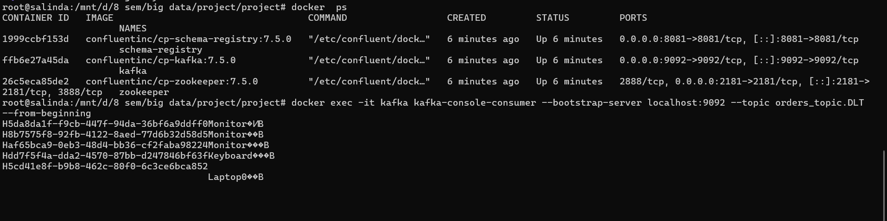
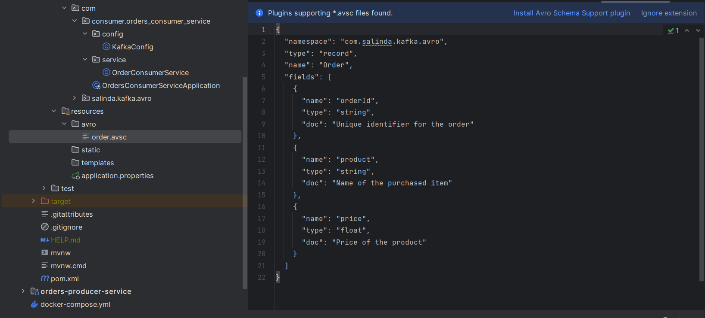
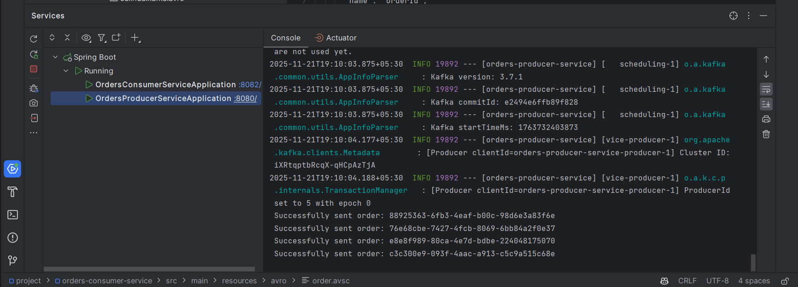
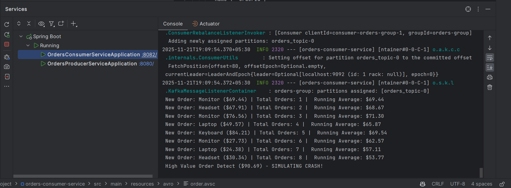
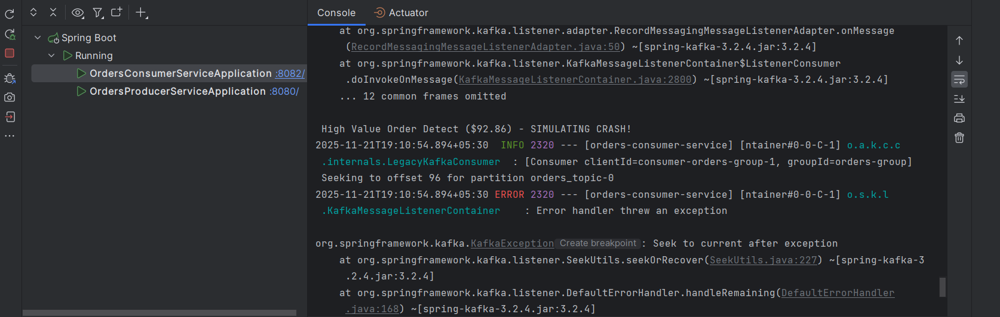
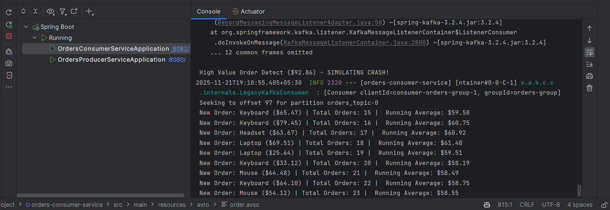
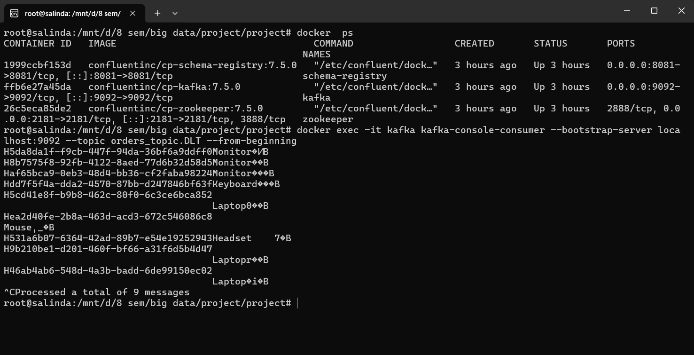

# Kafka Avro Order Processing System

## 📌 Project Overview
This project implements a robust, event-driven microservices architecture using **Spring Boot** and **Apache Kafka**. It demonstrates high-performance message processing using **Avro Serialization** and ensures system reliability through **Retry Logic** and **Dead Letter Queues (DLQ)**.

The system consists of two independent microservices:
1.  **Producer Service:** Generates random e-commerce orders and serializes them using Avro.
2.  **Consumer Service:** Consumes orders, calculates a real-time running average of prices, and handles failures gracefully.

---

## 🛠️ Technologies Used
* **Java 17**
* **Spring Boot 3.3.5** (Spring for Apache Kafka)
* **Apache Kafka** (Message Broker)
* **Confluent Schema Registry** (Avro Schema Management)
* **Docker & Docker Compose** (Infrastructure)
* **Apache Avro** (Binary Serialization)

---

## 🚀 Setup & Installation

### 1. Prerequisites
* Docker Desktop installed and running.
* Java 17 SDK.
* Maven.

### 2. Start Infrastructure
Run the following command to start Zookeeper, Kafka, and the Schema Registry:
```bash
docker-compose up -d
```
### 3. Build and Run Services

```bash
./mvnw clean compile
```
(This step generates the Avro Java classes from the order.avsc file)

### 4. Run the Applications
1. docker compose up -d
2. Start the Producer Service (Runs on port 8080). 
3. Start the Consumer Service (Runs on port 8082).


## Proof of Implementation

### Infrastructure Setup
   The system infrastructure runs on Docker containers, ensuring isolation and easy setup.
   
### Avro Contract (Schema)
   The system enforces strict data typing using the defined Avro schema (order.avsc), complying with the assignment requirements (String/String/Float).
   
### Real-Time Aggregation
   The Consumer calculates the running average price of all incoming orders in real-time.
   
    
### Resilience & Retry Logic
   The system simulates a crash for "High Value" orders (>$90). As shown below, the Consumer attempts to retry the message 3 times before giving up, ensuring temporary glitches don't crash the system.

   
* After 3 attempts the message is sent to DLQ.
* At last the failed message is routed to the Dead Letter Queue (DLQ) for further inspection and handling.
* Then continues processing other messages without disruption.
   

### Dead Letter Queue (DLQ) Verification
Permanently failed messages are not lost. They are moved to a generic Dead Letter Topic (orders_topic.DLT). The command below verifies the existence of these messages in the DLQ.


---
## How to Test Manually
**View Real-Time Logs**
Watch the Consumer console. You will see:
* Successful processing and updated running average.

*  Simulated failures for expensive items, followed by recovery.

**Verify DLQ**

To inspect the Dead Letter Queue content, run:
```bash
docker exec -it kafka kafka-console-consumer --bootstrap-server localhost:9092 --topic orders_topic.DLT --from-beginning
```

## Author
EG/2020/3945 Gunarathna K.M.W.G.S.L